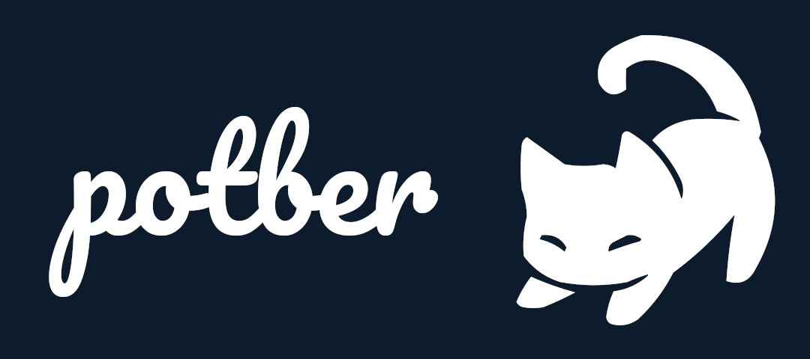

A mobile-first web client for the german internet forum <a href="https://forum.mods.de" target="_blank">forum.mods.de</a> built with <a href="https://emberjs.com/" target="_blank">ember.js</a>. If you're looking for potber-api, you can find it <a hef="https://github.com/spuxx1701/potber-api" target="_blank">here</a>.

## Table of contents

- [How to use](#how-to-use)
- [Core features](#how-to-use)
  - [Browser support](#how-to-use)
  - [Standalone mode (PWA)](#standalone-mode-pwa)
  - [BBCode parser](#bbcode-parser)
- [How to develop or build the app](#how-to-develop-or-build-the-app)
  - [Preqrequesites](#prerequisites)
  - [Installation](#installation)
  - [Running / Development](#running--development)
    - [Linting](#linting)
    - [Testing](#testing)
    - [Building](#building)
    - [Deploying](#deploying)
- [Further Reading / Useful Links](#further-reading--useful-links)

## How to use

Visit https://www.potber.de (or https://test.potber.de for the staging environment) to use the app.

## Core features

### Browser support

Potber supports the following browsers. Other browser might work, but are not supported. The app might still behave and display differently on different devices.

- Chrome >= 108
- Chrome for Android >= 108
- Firefox >= 107
- Firefox for Android >= 107
- Safari on iOS >= 16.1

### Standalone mode (PWA)

The app supports standalone mode ([PWA](https://developer.mozilla.org/en-US/docs/Web/Progressive_web_apps)). In stadalone mode, the website behaves almost exactly like an App. Whether your browser supports standalone mode and how to enable it highly depends on your browser. Android Chrome offers an option to "Install app" in your website settings, while iOS Safari has an option to "Add website to home screen". If you're having trouble, maybe [this article](https://web.dev/learn/pwa/installation/) can be of help.

### BBCode parser

The application includes a functioning and fully custom BBCode parser written in TypeScript. It is able to parse most of the board's BBCode without errors and is being continously worked on. You can find it [here](app/services//content-parser.ts).

## How to develop or build the app

### Prerequisites

You will need the following things properly installed on your computer.

- [Git](https://git-scm.com/)
- [Node.js](https://nodejs.org/) (with npm)
- [Ember CLI](https://cli.emberjs.com/release/)
- [potber-api](ttps://github.com/spuxx1701/potber-api) - Without this web server, potber-client does not function.

### Installation

- `git clone https://github.com/spuxx1701/potber-client.git`
- `cd potber-client`
- `npm install`

### Running / Development

- Clone [potber-api](https://github.com/spuxx1701/potber-api) and start up a local instance.
- Start up the development server with `npm start`.
- Visit the app at [http://localhost:4200](http://localhost:4200).

#### Linting

- `npm run lint`
- `npm run lint:fix`

#### Testing

- `npm run test`
- `npm run test:coverage`

#### Building

- `ember build` (development)
- `ember build --environment staging` (staging)
- `ember build --environment production` (production)

#### Deploying

The application can be deployed via [Docker](https://docker.com). The application provides two different Dockerfiles for the staging and production environments:

- [staging](Dockerfile.staging)
- [production](Dockerfile.production)

After building the Docker image, you can run it locally or on a remote host. In case you're curious about how `potber.de` is hosted: Both the [test](https://test.potber.de) and [production](https://potber.de) environments run on a [Flux](https://fluxcd.io)-controlled [MicroK8s](https://microk8s.io) cluster. The infrastructure is documented [here](https://github.com/spuxx1701/flux/tree/master/cluster/apps/potber).

## Further Reading / Useful Links

- [ember.js](https://emberjs.com/) - The framework.
- [potber-api](https://github.com/spuxx1701/potber-api) - The web server that potber-client utilizes.
- [dockerhub](https://hub.docker.com/repository/docker/spuxx/potber-client/general) - The dockerhub repository.

## Credit

- Credit goes to deviant user [Emoxynha](https://www.deviantart.com/emoxynha) for the [incredible cute kitty](https://www.deviantart.com/emoxynha/art/Gif-309653475) that I'm using within the application's skeleton.
- Credit goes to deviant user [IvonChee](https://www.deviantart.com/ivonchee) for the [cute pixel cat bases](https://www.deviantart.com/ivonchee/art/F2U-pixel-cat-bases-859073695) I used as a template for the logo.
